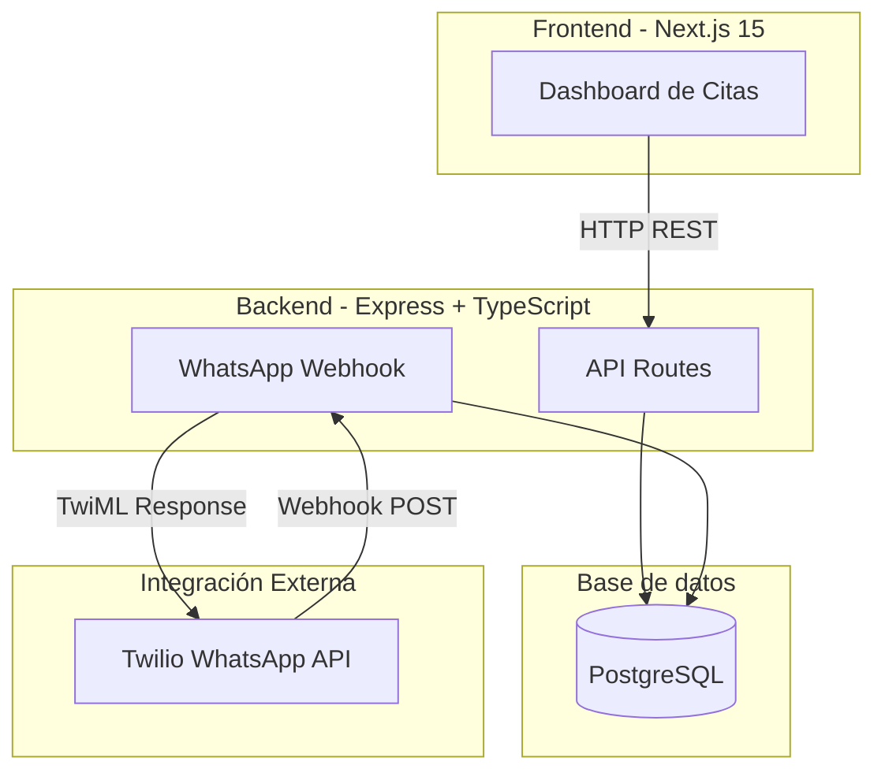

# Arquitectura del Sistema (SmartSalud V5)



## Componentes

| Componente | Tecnología | Descripción |
|------------|------------|-------------|
| Frontend | Next.js 15 + React 19 | Dashboard para ver y gestionar citas |
| Backend | Express + TypeScript | API REST + webhook WhatsApp |
| Database | PostgreSQL + Prisma | Almacena pacientes, citas, conversaciones |
| WhatsApp | Twilio API | Envío/recepción de mensajes |

## Flujo Principal

1. **Importar citas** → Excel → Dashboard → PostgreSQL
2. **Enviar recordatorio** → API → Twilio → WhatsApp del paciente
3. **Paciente responde** → Twilio → Webhook → Actualiza estado
4. **Dashboard actualiza** → Muestra nuevo estado

## Estados de Cita

```
AGENDADO → CONFIRMADO | REAGENDADO | CANCELADO
```

## Endpoints Principales

| Endpoint | Método | Descripción |
|----------|--------|-------------|
| `/api/appointments` | GET/POST | CRUD de citas |
| `/api/webhooks/whatsapp` | POST | Recibe mensajes WhatsApp |
| `/api/webhooks/whatsapp/send-reminder` | POST | Envía recordatorio |
| `/api/metrics/kpis` | GET | KPIs del dashboard |

---

*Última actualización: 2025-11-30*
